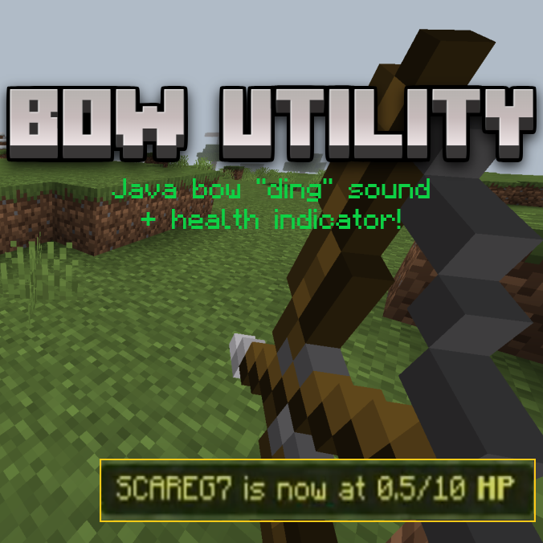

  <h1 align="center">WIP! ITS NOT STABLE YET!</h1>
  
  <h1 align="center">Java bow-ding sound</h1>
 
 Este addon añade el sonido de "ding" que se reproduce en Minecraft: Java edition cuando le atinas un disparo a un jugador usando un arco, pero este addon tambien lo reproduce con projectiles como bolas de nieve, tridentes, etc...

 

<h2 align="center"> Juegos experimentales </h2>

 Este add-on solo requiere la API beta para funcionar correctamente y no utiliza el archivo player.json. 

  

